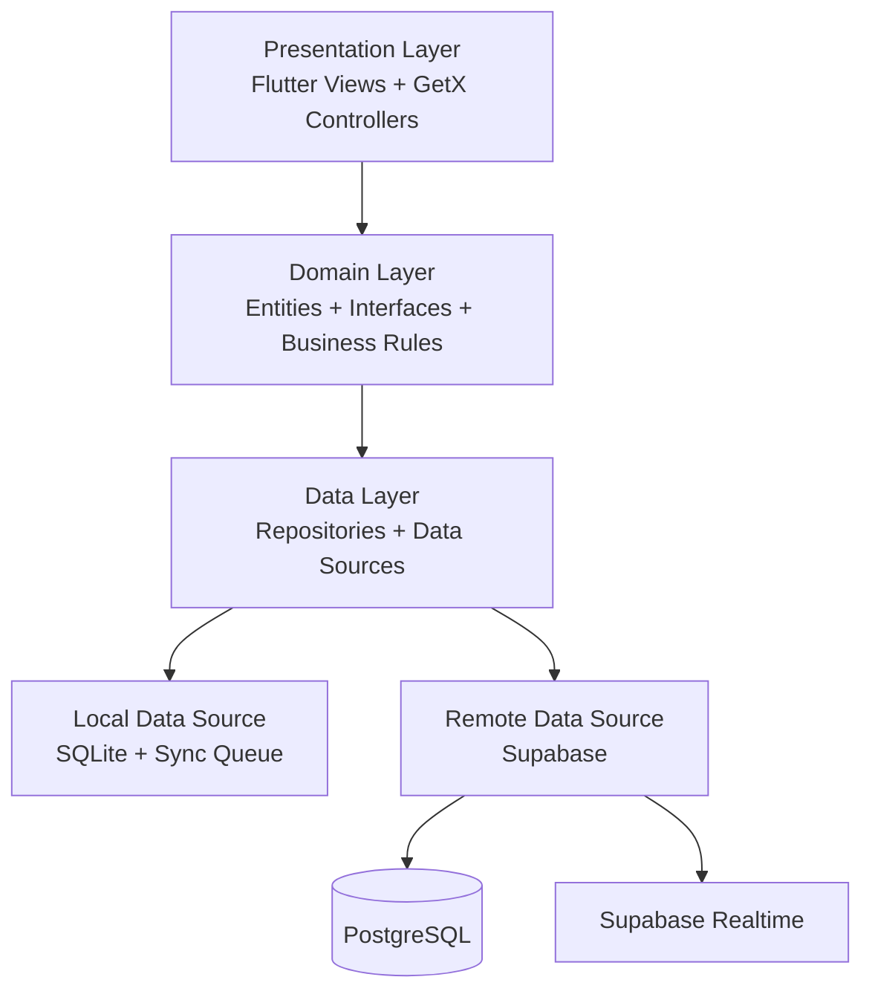

# 🛠️ ServiceSync — Field Service Management Platform

**ServiceSync** is a modern, enterprise-oriented **Field Service Management mobile application** built with Flutter for technicians, field operators, and service teams.

The application is designed to streamline the complete field-service workflow — from receiving and managing service requests to on-site verification, service reporting, customer signatures, attachments, and report generation.

ServiceSync follows an **offline-first architecture**, allowing technicians to continue working without an active internet connection and synchronize pending changes when connectivity is restored.

---

## ✨ Key Highlights

* 📱 Modern Flutter mobile application
* 📴 Offline-first field operations
* ☁️ Supabase-powered backend
* 🗄️ Local SQLite caching
* 🔄 Automatic synchronization
* ⚡ Real-time communication
* 🔐 QR-based service verification
* 🧾 Digital service reports
* ✍️ Customer signature capture
* 📄 PDF report generation
* 📊 Service and technician analytics
* 🗺️ Custom-rendered service maps
* 💬 Real-time technician communication
* 🎨 Premium Glassmorphism interface
* 🏗️ Clean Architecture with GetX

---

# 🏗️ Architecture

ServiceSync follows **Clean Architecture principles** to separate presentation, domain, and data responsibilities.



### Architecture Goals

* Separation of concerns
* Testable business logic
* Replaceable data sources
* Offline support
* Mock-friendly development
* Maintainable feature modules
* Scalable application structure

---

# 📁 Project Structure

```text
lib/
│
├── core/
│   ├── routes/
│   │   └── app_pages.dart
│   │
│   ├── theme/
│   │   └── app_theme.dart
│   │
│   ├── constants/
│   ├── utils/
│   └── widgets/
│
├── data/
│   ├── datasources/
│   │   ├── local/
│   │   │   ├── sqlite_helper.dart
│   │   │   └── sync_queue.dart
│   │   │
│   │   └── remote/
│   │       └── supabase_service.dart
│   │
│   ├── models/
│   │   ├── user_model.dart
│   │   ├── service_request_model.dart
│   │   ├── service_report_model.dart
│   │   └── chat_message_model.dart
│   │
│   └── repositories/
│
├── presentation/
│   ├── controllers/
│   │   ├── auth_controller.dart
│   │   ├── jobs_controller.dart
│   │   ├── chat_controller.dart
│   │   ├── reports_controller.dart
│   │   └── calendar_controller.dart
│   │
│   └── views/
│       ├── auth/
│       ├── dashboard/
│       ├── jobs/
│       ├── reports/
│       ├── calendar/
│       ├── chat/
│       └── settings/
│
└── main.dart
```

> The structure may evolve as additional modules and services are introduced.

---

# ⚡ Technology Stack

| Technology            | Purpose                                             |
| --------------------- | --------------------------------------------------- |
| **Flutter**           | Cross-platform mobile application                   |
| **Dart**              | Application development                             |
| **GetX**              | State management, routing, and dependency injection |
| **Supabase**          | Authentication, PostgreSQL, Realtime, and Storage   |
| **PostgreSQL**        | Remote relational database                          |
| **SQLite**            | Local offline data storage                          |
| **sqflite**           | SQLite database integration                         |
| **Connectivity Plus** | Network connectivity detection                      |
| **fl_chart**          | Charts and analytics                                |
| **pdf**               | PDF document generation                             |
| **printing**          | PDF preview and printing                            |
| **signature**         | Customer signature capture                          |
| **mobile_scanner**    | QR-code scanning                                    |
| **Google Fonts**      | Application typography                              |

---

# 🌟 Core Features

## 1. 📴 Offline-First Field Operations

Technicians can continue working even when there is no internet connection.

Local actions are stored in SQLite and placed into a synchronization queue.

```text
Technician Action
       │
       ▼
Internet Available?
   ┌───┴────┐
   │        │
  YES       NO
   │        │
   ▼        ▼
Supabase   SQLite
             │
             ▼
        Sync Queue
             │
             ▼
      Connection Restored
             │
             ▼
          Supabase
```

The synchronization system can queue operations such as:

* Service reports
* Technician notes
* Service logs
* Chat messages
* Status updates
* Other locally generated records

---

## 2. 🔄 Realtime Synchronization

Supabase Realtime enables the application to receive changes without requiring constant manual refreshes.

Possible realtime events include:

* New service requests
* Job assignment updates
* Service status changes
* Chat messages
* Report updates

This allows technicians and service teams to remain synchronized with the latest operational information.

---

# 🎨 Premium Glassmorphism UI

ServiceSync uses a modern **Glassmorphism-inspired visual system** designed for a premium field-service experience.

### UI Characteristics

* Dark-focused interface
* Frosted glass surfaces
* `BackdropFilter` effects
* Gradient overlays
* Rounded cards
* Status indicators
* Animated dashboard metrics
* Interactive navigation
* Consistent spacing and typography
* Responsive layouts

Primary visual foundation:

```text
Background: #0A0E27
```

The interface is designed to remain visually consistent across dashboards, job cards, reports, chat, calendars, and settings.

---

# 🔐 QR Service Verification

Technicians can scan customer or service-specific QR codes during on-site visits.

```text
Technician
    │
    ▼
Scan QR Code
    │
    ▼
Validate QR
    │
    ▼
Identify Service Request
    │
    ▼
Open Service Details
```

This provides an additional verification step before accessing detailed service information.

---

# 🧾 Service Report System

ServiceSync provides a structured workflow for creating digital service reports.

### Report Workflow

```text
Service Request
       │
       ▼
Service Details
       │
       ▼
Findings
       │
       ▼
Actions Taken
       │
       ▼
Parts Used
       │
       ▼
Photos / Attachments
       │
       ▼
Customer Signature
       │
       ▼
Generate Report
```

Reports can include:

* Service findings
* Actions performed
* Completion notes
* Parts used
* Images
* Technician information
* Customer information
* Customer signature
* Voice notes
* Timestamp

---

# ✍️ Digital Signature

Technicians can capture a customer's signature directly inside the application.

The signature can then be associated with the service report and included in the generated PDF.

This helps reduce dependency on paper-based service forms.

---

# 📄 PDF Report Generation

ServiceSync can generate professional service reports directly from completed service records.

Generated reports can contain:

* Customer information
* Service request details
* Technician information
* Service findings
* Actions taken
* Parts used
* Attached images
* Customer signature
* Completion information

The application uses Flutter PDF tooling to generate documents suitable for previewing, sharing, or printing.

---

# 🗺️ Custom Service Maps

ServiceSync includes custom map visualization using Flutter's rendering capabilities.

Instead of relying entirely on paid map-rendering services, the application can render service-related:

* Routes
* Polylines
* Grid structures
* Location markers
* Service areas

using a custom `CustomPaint`-based rendering approach.

This provides greater control over the application's map visualization layer.

---

# 💬 Communication

The application supports technician communication through a realtime chat experience.

Possible capabilities include:

* Technician-to-team messaging
* Service-related notes
* Realtime message updates
* Offline message queuing
* Timestamped conversations

---

# 📊 Dashboard & Analytics

The dashboard provides a centralized overview of field operations.

Example metrics include:

```text
┌──────────────────────┬──────────────────────┐
│ Assigned Jobs        │ Completed Jobs       │
│        18            │        42            │
├──────────────────────┼──────────────────────┤
│ Pending Reports      │ Completion Rate      │
│         6            │        82%           │
└──────────────────────┴──────────────────────┘
```

Charts can be used to visualize:

* Job completion
* Service activity
* Technician performance
* Report statistics
* Workload trends

---

# 🗄️ Supabase Database

ServiceSync uses **Supabase** for remote authentication, database operations, realtime communication, and storage.

## Database Schema

### Users

```sql
CREATE TABLE public.users (
  id UUID REFERENCES auth.users ON DELETE CASCADE PRIMARY KEY,
  full_name TEXT,
  email TEXT,
  phone TEXT,
  role TEXT DEFAULT 'technician',
  profile_image TEXT,
  created_at TIMESTAMP WITH TIME ZONE DEFAULT TIMEZONE('utc'::text, NOW()) NOT NULL,
  assigned_jobs INTEGER DEFAULT 0,
  completed_jobs INTEGER DEFAULT 0,
  completion_rate NUMERIC DEFAULT 0.0
);
```

### Service Requests

```sql
CREATE TABLE public.service_requests (
  request_id TEXT PRIMARY KEY,
  customer_name TEXT,
  customer_id TEXT,
  service_type TEXT,
  issue_description TEXT,
  status TEXT DEFAULT 'pending',
  assigned_technician TEXT,
  service_date TIMESTAMP WITH TIME ZONE,
  priority TEXT DEFAULT 'medium',
  address TEXT,
  latitude DOUBLE PRECISION,
  longitude DOUBLE PRECISION,
  created_at TIMESTAMP WITH TIME ZONE DEFAULT TIMEZONE('utc'::text, NOW()) NOT NULL,
  qr_code TEXT
);
```

### Service Reports

```sql
CREATE TABLE public.service_reports (
  report_id TEXT PRIMARY KEY,
  service_request_reference TEXT,
  findings TEXT,
  actions_taken TEXT,
  completion_notes TEXT,
  images TEXT,
  signature TEXT,
  voice_note TEXT,
  timestamp TIMESTAMP WITH TIME ZONE DEFAULT TIMEZONE('utc'::text, NOW()) NOT NULL,
  technician_id TEXT,
  customer_name TEXT,
  parts_used TEXT
);
```

---

# 🚀 Installation & Setup

## Prerequisites

Make sure you have:

* Flutter SDK
* Dart SDK
* Android Studio or VS Code
* Android SDK
* Git
* Supabase project

Verify your Flutter installation:

```bash
flutter doctor
```

---

## 1. Clone the Repository

```bash
git clone <repository-url>
cd ServiceSync
```

---

## 2. Install Dependencies

```bash
flutter pub get
```

---

## 3. Configure Supabase

Create/configure your Supabase project and provide the required project configuration to the application.

Make sure the required:

* Authentication
* PostgreSQL tables
* Storage buckets
* Realtime configuration
* Database policies

are configured before using production data.

---

## 4. Launch the Application

```bash
flutter run
```

---

# 🔧 App Icons

Native launcher icons can be generated using `flutter_launcher_icons`.

After replacing the application logo:

```text
assets/images/logo.png
```

Run:

```bash
flutter pub run flutter_launcher_icons
```

---

# 🔑 Demo Mode

ServiceSync can provide a demonstration experience when Supabase credentials are unavailable or unreachable.

### Demo Credentials

```text
Email:    any@servicesync.com
Password: demo1234
```

Demo mode can be used to demonstrate the application's UI and core workflows without requiring an active production backend.

> Do not use demo credentials or mock data for production deployments.

---

# 🔐 Security Considerations

For production deployment, the following security practices should be implemented:

* Enable appropriate Supabase Row Level Security policies.
* Restrict database access based on authenticated users and roles.
* Protect storage buckets.
* Validate QR-code requests server-side.
* Avoid exposing privileged Supabase credentials in the mobile application.
* Validate all user-generated data.
* Secure file uploads.
* Restrict technician access to assigned service requests.
* Keep production credentials outside source control.

---

# 🧪 Development & Testing

Run static analysis:

```bash
flutter analyze
```

Run tests:

```bash
flutter test
```

Build an Android release:

```bash
flutter build apk --release
```

Recommended pre-release checks:

```bash
flutter clean
flutter pub get
flutter analyze
flutter test
flutter build apk --release
```

---

# 🔄 Service Lifecycle

A typical ServiceSync workflow looks like:

```text
New Request
     │
     ▼
Assigned to Technician
     │
     ▼
Technician Accepts Job
     │
     ▼
QR Verification
     │
     ▼
On-Site Service
     │
     ├── Findings
     ├── Actions
     ├── Parts
     └── Photos
     │
     ▼
Customer Signature
     │
     ▼
Service Report
     │
     ▼
PDF Generation
     │
     ▼
Job Completed
```

---

# 📱 Main Application Modules

| Module             | Description                             |
| ------------------ | --------------------------------------- |
| **Authentication** | Login and user access                   |
| **Dashboard**      | Operational overview and analytics      |
| **Jobs**           | Service request management              |
| **Reports**        | Digital service report creation         |
| **Calendar**       | Service scheduling                      |
| **Chat**           | Technician communication                |
| **Maps**           | Custom route and location visualization |
| **Settings**       | Application and account configuration   |

---

# 🔮 Future Roadmap

Potential improvements include:

* [ ] Role-based access control
* [ ] Admin web dashboard
* [ ] Advanced technician assignment
* [ ] Push notifications
* [ ] Background synchronization
* [ ] Advanced offline conflict resolution
* [ ] GPS technician tracking
* [ ] Customer portal
* [ ] Customer service history
* [ ] Automated report sharing
* [ ] WhatsApp report sharing
* [ ] Advanced analytics
* [ ] Inventory and parts management
* [ ] Multi-company support
* [ ] Multi-language support
* [ ] Cloud backup and disaster recovery
* [ ] Automated CI/CD deployment

---

# 🎯 Project Objectives

ServiceSync is designed around five core objectives:

### 1. 📱 Digitize Field Operations

Replace paper-based service workflows with a centralized mobile solution.

### 2. 📴 Work Without Internet

Allow technicians to continue working even in areas with unreliable connectivity.

### 3. 🔄 Keep Teams Synchronized

Use realtime communication and background synchronization to keep operational data current.

### 4. 🧾 Simplify Reporting

Create complete digital service reports with photos, notes, parts, and customer signatures.

### 5. 📊 Improve Visibility

Give service teams better insight into jobs, completion rates, reports, and technician activity.

---

# 🤝 Contributing

Contributions and improvements are welcome.

1. Fork the repository.
2. Create a feature branch:

```bash
git checkout -b feature/your-feature
```

3. Implement your changes.
4. Run analysis and tests:

```bash
flutter analyze
flutter test
```

5. Commit your changes:

```bash
git commit -m "feat: add your feature"
```

6. Push the branch:

```bash
git push origin feature/your-feature
```

7. Open a Pull Request.

---

# 📄 License

This project is currently maintained for development and demonstration purposes.

Add the appropriate license if the project is released publicly.

---

# 🛠️ ServiceSync

**Field service management, built for technicians who work anywhere.**

**Flutter · Dart · GetX · Supabase · PostgreSQL · SQLite**

> **Work offline. Stay connected. Report digitally. Service smarter.**
