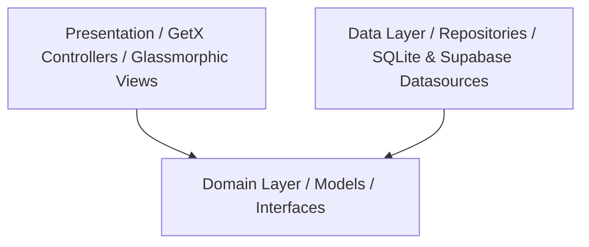

# 🛠️ ServiceSync — Field Service Management Mobile Application

ServiceSync is a premium, enterprise-grade, offline-first mobile application built for technicians and field operators. It features a high-end Glassmorphism theme, dynamic real-time communication, zero-billing custom map rendering, and robust offline synchronization using GetX, Supabase, and SQLite.

---

## 🏗️ Architecture Design System

The application strictly adheres to **Clean Architecture** patterns to enforce separation of concerns, testability, and mock-readiness.



### Directory Structure

```text
lib/
├── core/
│   ├── routes/          # GetX Page Routing (app_pages.dart)
│   └── theme/           # Premium Glassmorphic Design Token Configs
├── data/
│   ├── datasources/
│   │   ├── local/       # SQLite Helper (sqlite_helper.dart) & Mock Data Seeds
│   │   └── remote/      # Supabase Client Core Hooks (supabase_service.dart)
│   └── models/          # UserModel, ServiceRequestModel, ChatMessageModel, etc.
└── presentation/
    ├── controllers/     # GetX Controllers (Auth, Jobs, Chat, Reports, Calendar)
    └── views/           # Views (Dashboard, Jobs, Reports, Calendar, Settings, Chat)
```

---

## ⚡ Core Tech Stack

* **Front-End Framework**: Flutter (configured with Outfit and Google Fonts for premium typography).
* **State Management**: GetX (controllers, lazy bindings, and Rx reactivity).
* **Database & Auth (Remote)**: Supabase (Auth, PostgreSQL DB, Real-Time Subscriptions, and Storage Buckets).
* **Cache Database (Local)**: SQLite (handled using `sqflite` for offline caching and synchronization).
* **Networking**: Supabase Realtime Channels + Connectivity Plus for checking internet state.
* **Specialized Libraries**:
  * `fl_chart`: Sleek statistics and completion curves.
  * `pdf` & `printing`: Helvetica PDF report generation.
  * `signature`: Fingerprint canvas signature extraction.
  * `mobile_scanner`: QR-code verification for security handshakes.

---

## 🌟 Premium Features

### 1. Offline-First Realtime Synchronization
* Tracks local actions inside a SQLite `sync_queue` table during offline states.
* Batch uploads cached reports, service logs, and chat notes once network connectivity returns.
* Dynamically presents an offline banner indicating queue status.

### 2. High-End Glassmorphic UI/UX
* Vibrant dark mode layout (`0xFF0A0E27`) utilizing `BackdropFilter` and gradient overlays.
* Micro-animations on dashboard metrics, custom status chips, and tab switches.
* Fully uniform card rendering with left-colored status indicators.

### 3. QR-Code Security Verification
* Technicians scan unique customer QR codes on-site to unlock detailed service tickets.
* Prevents spoofing and confirms active physical presence.

### 4. Interactive Report Creator Wizard
* 3-step structured form for service logs, technician notes, custom parts databases, and photo attachments.
* Real-time canvas drawing to capture customer signatures.
* Exports detailed service tickets as clean PDFs utilizing core fonts for compatibility.

### 5. Custom Polyline Street Maps
* Bypasses billing boundaries by drawing interactive routes and grids using a high-performance `CustomPaint` engine.

---

## 🛠️ Supabase Schema Configuration

To run with an active Supabase backend, execute the following PostgreSQL commands in your Supabase SQL editor:

```sql
-- Profiles table linked to Supabase Auth Users
CREATE TABLE public.users (
  id UUID REFERENCES auth.users ON DELETE CASCADE PRIMARY KEY,
  full_name TEXT,
  email TEXT,
  phone TEXT,
  role TEXT DEFAULT 'technician',
  profile_image TEXT,
  created_at TIMESTAMP WITH TIME ZONE DEFAULT TIMEZONE('utc'::text, NOW()) NOT NULL,
  assigned_jobs INTEGER DEFAULT 0,
  completed_jobs INTEGER DEFAULT 0,
  completion_rate NUMERIC DEFAULT 0.0
);

-- Service requests database table
CREATE TABLE public.service_requests (
  request_id TEXT PRIMARY KEY,
  customer_name TEXT,
  customer_id TEXT,
  service_type TEXT,
  issue_description TEXT,
  status TEXT DEFAULT 'pending',
  assigned_technician TEXT,
  service_date TIMESTAMP WITH TIME ZONE,
  priority TEXT DEFAULT 'medium',
  address TEXT,
  latitude DOUBLE PRECISION,
  longitude DOUBLE PRECISION,
  created_at TIMESTAMP WITH TIME ZONE DEFAULT TIMEZONE('utc'::text, NOW()) NOT NULL,
  qr_code TEXT
);

-- Service reports database table
CREATE TABLE public.service_reports (
  report_id TEXT PRIMARY KEY,
  service_request_reference TEXT,
  findings TEXT,
  actions_taken TEXT,
  completion_notes TEXT,
  images TEXT,
  signature TEXT,
  voice_note TEXT,
  timestamp TIMESTAMP WITH TIME ZONE DEFAULT TIMEZONE('utc'::text, NOW()) NOT NULL,
  technician_id TEXT,
  customer_name TEXT,
  parts_used TEXT
);
```

---

## 🚀 Quickstart & Setup Guide

### 1. Install Dependencies
```bash
flutter pub get
```

### 2. Configure Native App Icons
Native Android and iOS app launcher icons are configured via `flutter_launcher_icons`. If you update `assets/images/logo.png`, run:
```bash
flutter pub run flutter_launcher_icons
```

### 3. Launching the App
Run in your local environment via:
```bash
flutter run
```

### 🔓 Demo Login Credentials
The application loads premium mock data out-of-the-box when Supabase credentials are not reachable:
* **Email**: `any@servicesync.com`
* **Password**: `demo1234`
